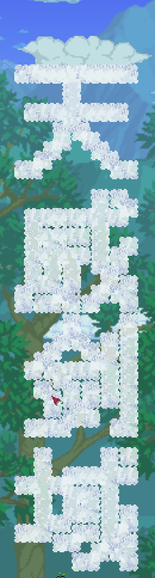

# 背景
需求是需要在 tModLoader 中向泰拉瑞亚中画出文本图案


# 方案
一个很容易想到的方案是使用 TEdit 编辑 .wld 地图文件，在指定位置上手动画出文本内容

但是这种方案就脱离 mod 自动化的方向了。
分析下如果我们要自动化在游戏中画出文本图形需要做哪些工作

- 1. 需要知道指定字体的文字的图形
- 2. 同时需要文字排版引擎布局多个文字
- 3. 需要将这些文字的图形信息使用游戏纹理表示，并放在游戏的指定位置

如果有一定的图形化经验(前端/移动端)会发现,1和2不正式 canvas.drawText 就已经实现的嘛。在 c# 中，可以将文本画到 bitmap 上，那么 bitmap 就有了已经排版好图形信息了。最后只需要将 bitmap 的二维像素点中非白色的像素点就是我们想要的游戏纹理块。

# 实现
```csharp
public static void drawText(Point startPoint, int sizeWidth, int sizeHeight, string words)
{
  int width = 15, height = 100;
  int textWidth = width * 3 / 5;
  
  //将文本处理成所需的图形信息
  System.Drawing.Bitmap bmp = new System.Drawing.Bitmap(width, height);
  System.Drawing.RectangleF rectf = new System.Drawing.RectangleF(0, 0, width, height);
  System.Drawing.Graphics g = System.Drawing.Graphics.FromImage(bmp);
  System.Drawing.StringFormat drawFormat = new System.Drawing.StringFormat();
  drawFormat.FormatFlags = System.Drawing.StringFormatFlags.DirectionVertical;
  g.DrawString(words, new System.Drawing.Font("Arial", textWidth), System.Drawing.Brushes.Black, rectf, drawFormat);
  g.Dispose();

  //将图形信息绘制到游戏中
  for (int x = 0; x < bmp.Width; x++)
    for (int y = 0; y < bmp.Height; y++)
    {
      System.Drawing.Color color = bmp.GetPixel(x, y);
      if (color.ToArgb() != 0)
        WorldGen.PlaceWall(startPoint.X + x, startPoint.Y + y, 73);
    }
  bmp.Dispose();
}
```

# 扩展思考
甚至可以在游戏中绘制任意的图形。甚至可以根据约定不同的像素颜色为不同的纹理，将一张已经处理过的低分辨率的图片绘制到游戏中是可行的，甚至可以绘制 gif。